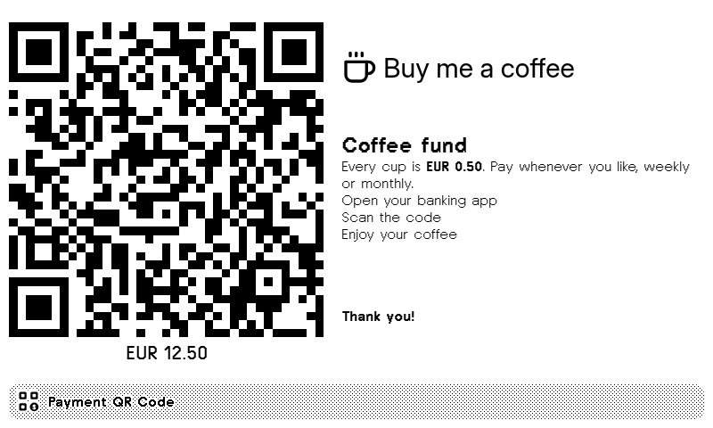
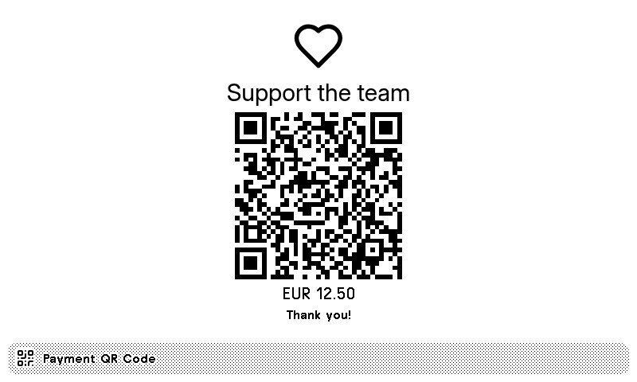
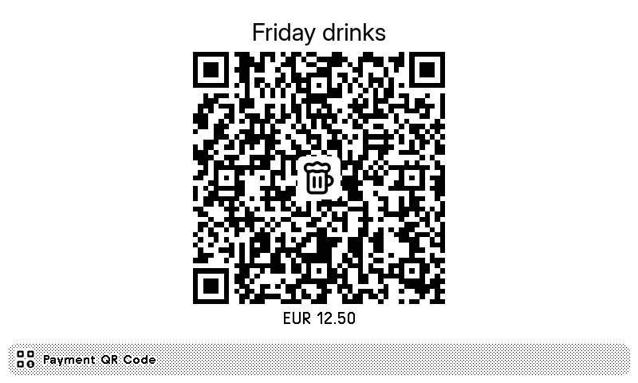
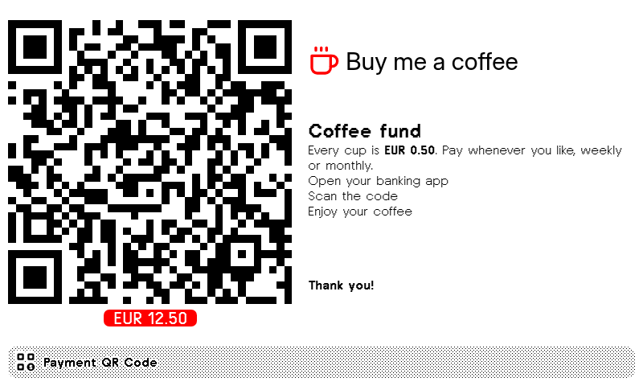

# Payment QR Code for TRMNL


Show a scannable payment QR code with your own text on a TRMNL.

- **SEPA transfer (EPC QR)**, scanned by most European banking apps, with a fixed amount or one the payer chooses
- **Any link or text**: PayPal.me, Revolut, Payconiq, Stripe, Bitcoin, ...
- **Layouts**: QR left with text right (or reversed), poster (title, QR, footer), QR only. Side-by-side layouts stack on portrait screens and half vertical mashups.
- Markdown text that shrinks to fit, an icon or your own image (next to the title, above the text, or in the middle of the QR code)
- All four view sizes, OG, TRMNL X and `sm` devices; an accent color on color panels (BWRY etc.)

| | |
|---|---|
|  |  |
|  |  |

## Optional webhook

The plugin settings are the defaults. Data sent to the plugin's webhook overrides them field by field, for example a new amount and reference per payment. Clearing it shows the settings again; the "Webhook Data Expires After" setting can do that automatically.

**Web editor:** <https://excusemi.github.io/trmnl-payment-qr-code-plugin/>. Paste your webhook URL, change fields, send or clear. "Download my editor" saves a single HTML file with your webhook URL built in.

Anyone with the webhook URL can change the QR code, so keep the URL (and the downloaded file) private.

Or from a script, using the same keys as the settings:

```sh
curl "https://trmnl.com/api/custom_plugins/<uuid>" -H "Content-Type: application/json" -X POST \
  -d '{"merge_variables": {"payment": {"epc_amount": "42.00", "epc_reference": "Pizza night", "updated_at": 1790000000}}}'
```

Keys: `payment_type` (`epc`/`text`), `epc_name`, `epc_iban`, `epc_bic`, `amount_mode` (`fixed`/`open`), `epc_amount`, `epc_reference`, `qr_text`, `title`, `caption`, `body`, `footer`, `layout`, `icon`, `image_url`. TRMNL allows 12 webhook updates per hour and 2 KB of data.

## Development

```sh
cd plugin && trmnlp serve      # preview
python3 test/shots.py [case]   # screenshots of every layout and device into test/shots/
```

Icons are from [Lucide](https://lucide.dev) (ISC).
