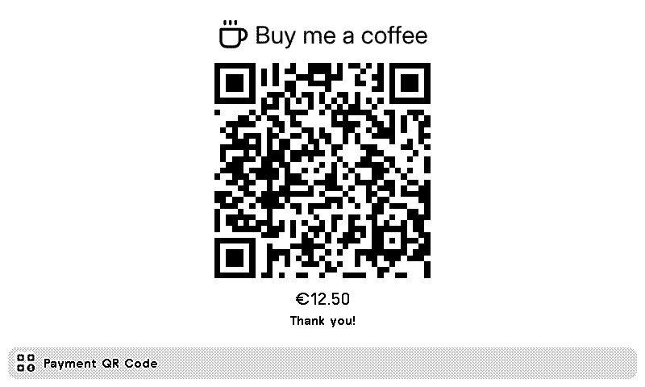
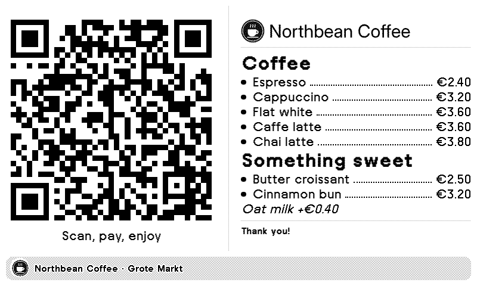
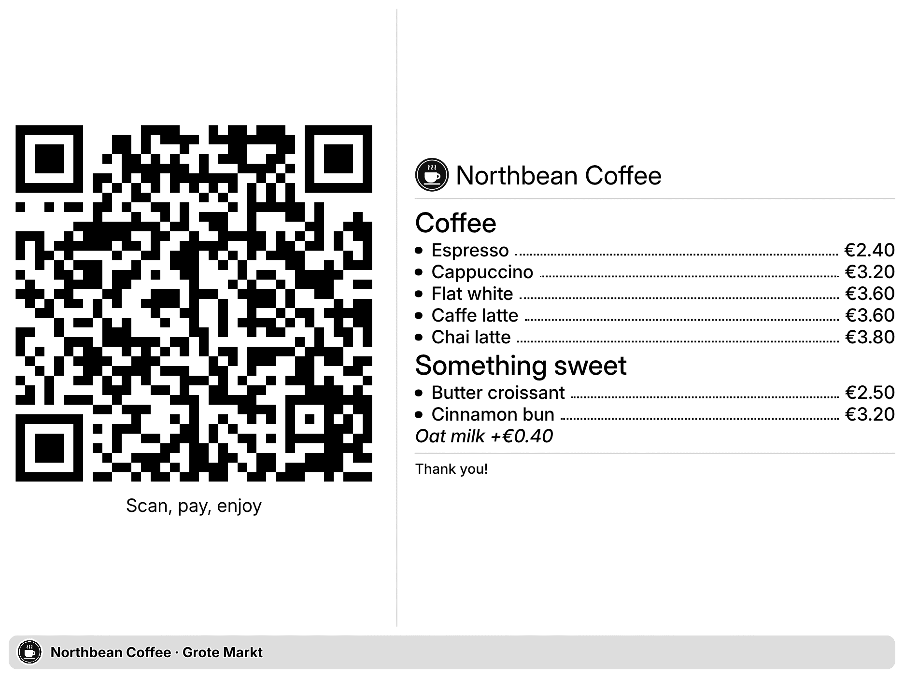
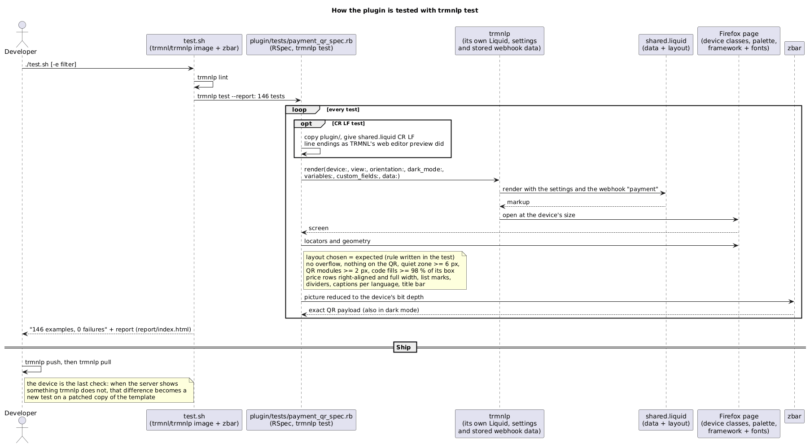

# Payment QR Code for TRMNL


Show a scannable payment QR code with your own text on a TRMNL.

- **SEPA transfer (EPC QR)**, scanned by most European banking apps, with a fixed amount or one the payer chooses
- **Bancontact** for merchants with a Bancontact Pro (formerly Payconiq) payment profile: the plugin builds the `pay.bancontact.net` Top Up link from the profile ID, amount, title and reference, no API needed. Use a Top Up profile so one code can be paid many times; receipt and invoice profiles give single-use codes. No Bancontact logo is bundled: add the official mark through Image URL if your contract allows it
- An optional caption under the code: the amount, or your own text
- The plugin's own words (the amount caption, messages) follow the TRMNL account language: English, Dutch, French and German, with amounts written the local way (`€ 2,40`, `2,40 €`)
- **Any link or text**: PayPal.me, Revolut, Payconiq, Stripe, Bitcoin, ...
- **No layout settings**: with text the QR sits beside it (stacked on portrait screens and tall mashup slots); without text title, QR and footer are centered
- Markdown text that shrinks to fit, with bullets and price rows: `- Espresso | €2.40` puts the price on the right with a dotted leader
- An icon or your own image next to the title, and your own title bar text
- All four view sizes, OG, TRMNL X and `sm` devices; red accents on color panels (BWRY etc.)
- In dark mode the code stays black on a white tile, so it scans like in light mode
- Few settings: text size, QR size and error correction are chosen automatically

| | |
|---|---|
|  |  |
|  |  |

## Optional webhook

Set **Data Source** to **Webhook** in the plugin settings: the content fields hide, a copyable Webhook URL appears, and the screen shows only what is sent to that URL (until then it asks for payment details).

This is handy when other people keep the screen up to date: give employees the editor link (or the downloaded editor file) and they can change today's prices, amount or reference from a phone, without access to your TRMNL account or its settings.

**Web editor:** <https://excusemi.github.io/trmnl-payment-qr-code-plugin/>. Paste your webhook URL, change fields with a live device preview (rendered from this plugin's own template) and the JSON it will send, then send or clear. "Download my editor" saves a single HTML file with your webhook URL built in.

Anyone with the webhook URL can change the QR code, so keep the URL (and the downloaded file) private.

Example: [a coffee shop price list](assets/examples/coffee-shop.json) with a [made-up logo](assets/examples/northbean-logo.png):



On a TRMNL X the code is capped so the list gets more room:



Or from a script, using the same keys as the settings:

```sh
curl "https://trmnl.com/api/custom_plugins/<uuid>" -H "Content-Type: application/json" -X POST \
  -d '{"merge_variables": {"payment": {"epc_amount": "42.00", "epc_reference": "Pizza night", "updated_at": 1790000000}}}'
```

Webhook-only keys for the title bar as well: `show_title_bar` (`false` hides it), `title_bar` (its text) and `title_bar_icon` (an image URL).

Keys: `payment_type` (`epc`/`bancontact`/`text`), `epc_name`, `epc_iban`, `bc_profile_id`, `epc_amount` (`0` lets the payer choose), `epc_reference`, `qr_text`, `title`, `show_caption` (`true` shows the caption), `caption` (replaces the amount line), `body`, `footer`, `title_bar`, `title_bar_icon`, `show_title_bar`, `icon`, `image_url`. TRMNL allows 12 webhook updates per hour and 2 KB of data.

## How it is built

Everything happens in `plugin/src/shared.liquid`, which TRMNL runs on every render: it picks the data source, builds the EPC payload, caption, price rows and title bar, then chooses the layout for the view. A serverless transform was tried and dropped: on a webhook plugin it only runs when webhook data arrives, so settings changes never reached the screen.

## Development

```sh
cd plugin && trmnlp serve   # preview
./test.sh [-e filter]       # trmnlp lint + trmnlp test; needs Docker; report in report/index.html
```

The tests in `plugin/tests/` run on trmnlp's own [`trmnlp test`](https://github.com/usetrmnl/trmnlp#testing-plugins) (RSpec, Firefox), in the `trmnl/trmnlp` image with zbar added to scan the code: 146 tests on OG, TRMNL X, a small Kindle, portrait, dark mode, a color panel and both font sets, in every view, including trmnlp's own `a publishable recipe` checks. Each render must pick the expected layout, scan to exactly the expected payload, keep a quiet zone and QR modules of at least 2 px, and keep text inside the view and off the code. One test renders a copy of the template with CR LF newlines, as TRMNL's web editor preview did. The flow is drawn in [docs/testing.puml](docs/testing.puml):



Icons are from [Lucide](https://lucide.dev) (ISC).
